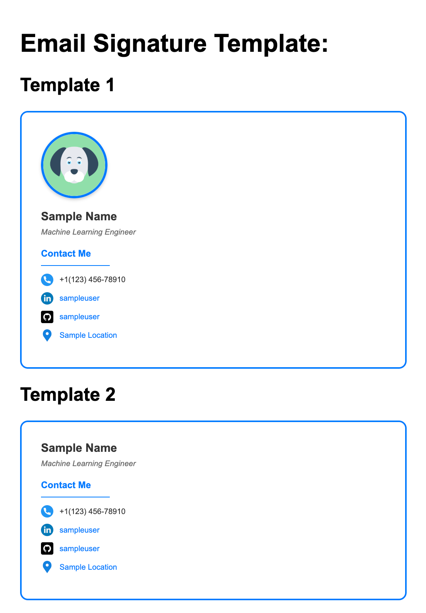

# Email Signature Template

A simple, clean email signature template that loads information from a configuration file.

## Files

- `signature.html` - The main template file with preview
- `config.json` - Configuration file with your personal information
- `load-config.js` - JavaScript that loads the configuration
- `images/` - Folder for your profile photo

## How to Use

1. Customize Your Information: Edit `config.json` with your actual information:
2. Add Your Photo:Place your profile picture as `image.png` in the `images/` folder.
3. Run a Local Server:
    -  Run `python3 -m http.server 5500`
    -  Open `http://localhost:5500/signature.html`
    -  Your information will automatically load from `config.json`
    -  Copy the HTML code from the textarea
    -  Paste it into your email client's signature settings

## Result:

## License

This project is licensed under the MIT License - see the [LICENSE](LICENSE) file for details.